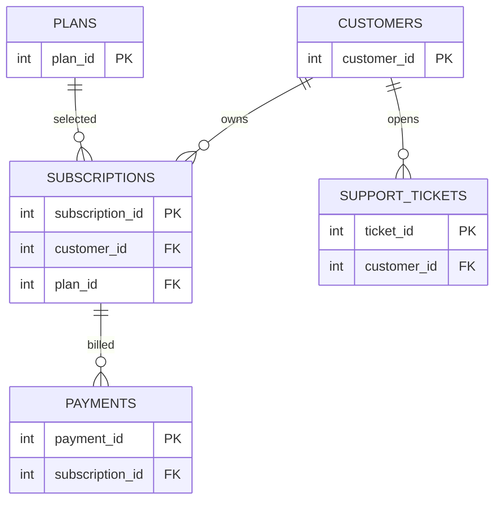

# Entity relationship diagram

```mermaid
erDiagram
    CUSTOMERS ||--o{ SUBSCRIPTIONS : owns
    PLANS ||--o{ SUBSCRIPTIONS : selected
    SUBSCRIPTIONS ||--o{ PAYMENTS : billed
    CUSTOMERS ||--o{ SUPPORT_TICKETS : opens
    CUSTOMERS { int customer_id PK }
    PLANS { int plan_id PK }
    SUBSCRIPTIONS { int subscription_id PK int customer_id FK int plan_id FK }
    PAYMENTS { int payment_id PK int subscription_id FK }
    SUPPORT_TICKETS { int ticket_id PK int customer_id FK }
```
